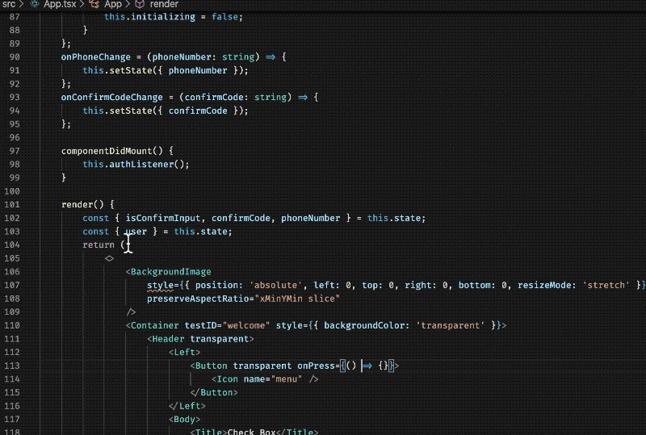
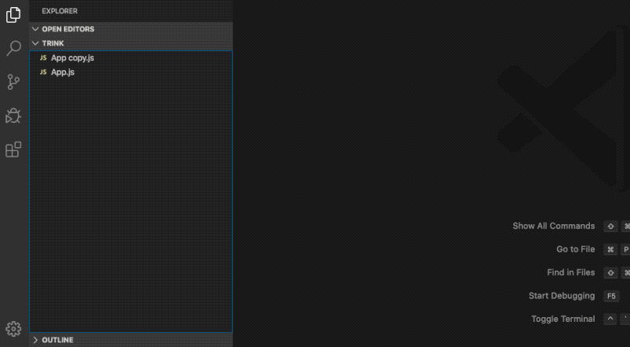
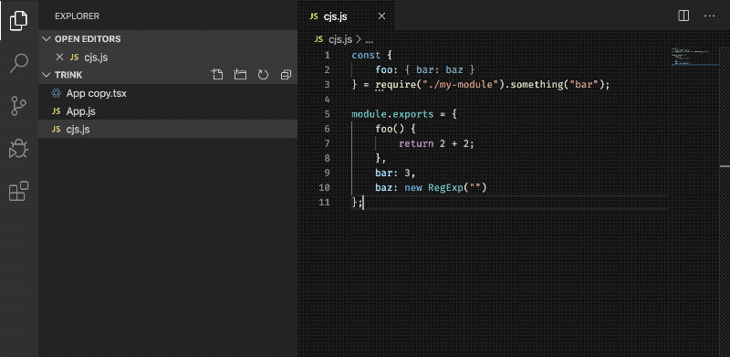

# react-toolkit  

This is VsCode plugin suppose to help developers convert their project to typescript.

Any suggestion are more then welcome

## Refactor React Native source code extracting inline styles from the VSCode menu

## Convert ReactJs to ReactTypescript

## Convert CommonJs to Typescript

